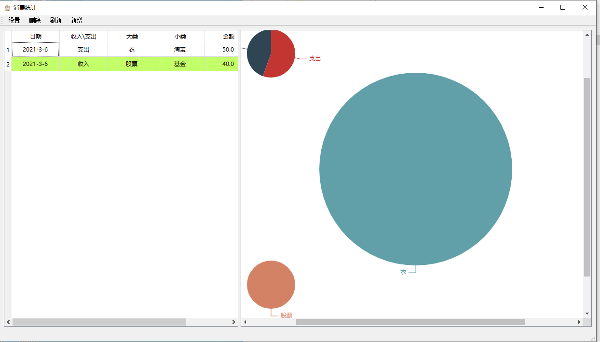

# 创建自己的钱包管理系统
## 开发备忘
1. 数据库的修改，都会引起图的自动刷新
2. 默认加载空模板
3. 修改table中的值，会引起数据库的update，并且引起自动刷新
4. 价格需要输入检查，可以输入负数，但是禁止输入“+”号
5. 添加了MySQL支持，但是要求提前创建好库和表。

## 打包编译
使用snap

## 博客
[通过PyQt5+PyQtWebEngine+pyecharts建立自己的收入支出记账软件](https://blog.csdn.net/dahaiya/article/details/114302333?spm=1001.2014.3001.5501)

## 整体图
